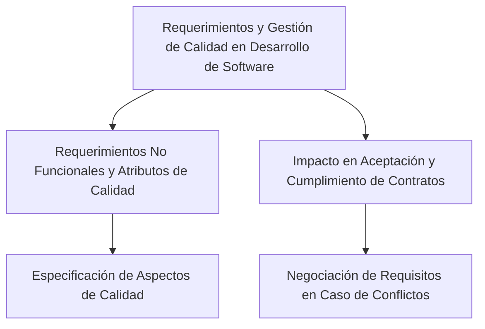

La relación entre los requerimientos y la gestión de calidad en el desarrollo de software es intrínsecamente fuerte y multifacética:

1. **Requerimientos No Funcionales y Atributos de Calidad**: Los requisitos no funcionales, que incluyen aspectos de calidad como rendimiento, seguridad y usabilidad, juegan un papel crucial en la gestión de calidad. La especificación precisa de estos requisitos no funcionales y sus atributos de calidad es fundamental para garantizar que el software cumpla con los estándares de calidad deseados【156†source】.

2. **Impacto en la Aceptación y Cumplimiento de Contratos**: La calidad y la exactitud de la especificación de los requisitos (ERS) pueden tener un impacto directo en la capacidad de cumplir con los objetivos del proyecto y las fechas de entrega. Errores en los requisitos críticos o problemas de calidad en la ERS pueden llevar a dificultades en el cumplimiento de los contratos establecidos con los clientes. Además, la negociación de los requisitos es una parte importante de la gestión de los mismos, especialmente cuando hay conflictos o falta de consenso entre los stakeholders【157†source】.

### Desarrollo
Establecer y mantener una relación sólida entre los requerimientos y la gestión de calidad asegura que el software desarrollado no solo cumpla con las necesidades funcionales de los usuarios, sino que también adhiera a los estándares de calidad establecidos, lo que resulta en un producto final más robusto y confiable.

### Mindmap

### Ejemplo
En un proyecto para desarrollar una plataforma de e-learning, los requerimientos no funcionales relacionados con la seguridad y la capacidad de respuesta del sistema son críticos para la gestión de la calidad. La negociación efectiva de estos requerimientos entre los diferentes stakeholders, como los administradores de la plataforma y los usuarios finales, es esencial para garantizar que el producto final cumpla con las expectativas de calidad y funcionalidad.

### Glosario
- **Requerimientos No Funcionales**: Aspectos del software relacionados con la calidad, como la seguridad, usabilidad y rendimiento.
- **Especificación de Requerimientos (ERS)**: Documento que detalla los requerimientos funcionales y no funcionales de un sistema de software.