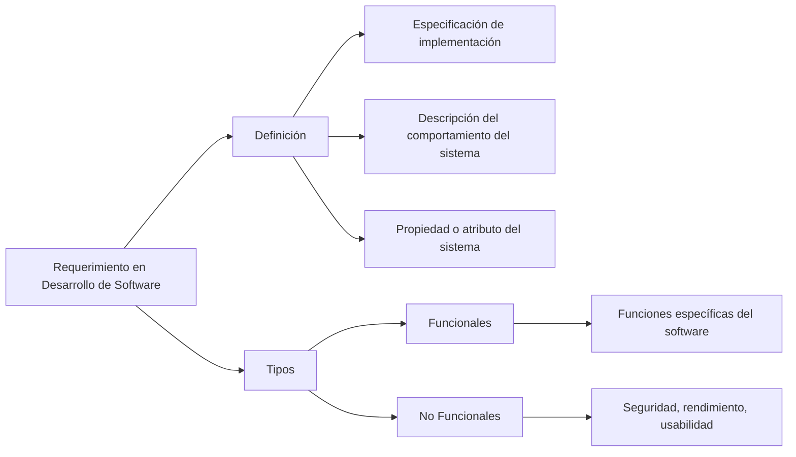

# ¿Cuáles son las actividades asociadas a la ingeniería de requerimientos?

En el contexto del desarrollo de software, un requerimiento, o más precisamente un "requisito", se define como una especificación de lo que debe ser implementado. Son descripciones de cómo el sistema debe comportarse, o de una propiedad del sistema o atributo. Pueden representar una limitación en el proceso de desarrollo del sistema.

Los requisitos en el desarrollo de software son fundamentales para guiar el proceso de creación y asegurar que el producto final cumple con las necesidades y expectativas del usuario. Estos requisitos pueden ser funcionales, describiendo las funciones específicas del software, o no funcionales, relacionados con la seguridad, rendimiento, o usabilidad.

### Mindmap

### Ejemplo
Imaginemos un software de gestión de inventarios. Un requisito funcional sería "El sistema debe permitir registrar nuevos productos", describiendo una función específica. Un requisito no funcional sería "El sistema debe cargar la página de inventario en menos de 3 segundos", relacionado con el rendimiento.

### Glosario
- **Especificación**: Descripción detallada de los requisitos, características, o parámetros de un proyecto.
- **Funcional**: Relacionado con las funciones o tareas específicas que un sistema o componente debe ser capaz de realizar.
- **No Funcional**: Relacionado con aspectos del sistema que no son funciones específicas, como seguridad, rendimiento, o usabilidad.
- **Usabilidad**: Facilidad con la que los usuarios pueden utilizar un sistema para lograr objetivos específicos de manera eficaz y satisfactoria.
- **Rendimiento**: Capacidad de un sistema para realizar sus funciones dentro de un tiempo específico bajo condiciones dadas.

### Evaluación
[Evaluación](https://colab.research.google.com/github/IngenieriaDeRequerimientosDaVinci/preguntas/blob/main/Unidad%201/Cu%C3%A1les%20son%20las%20actividades%20asociadas%20a%20la%20ingenier%C3%ADa%20de%20requerimientos/Evaluador.ipynb)