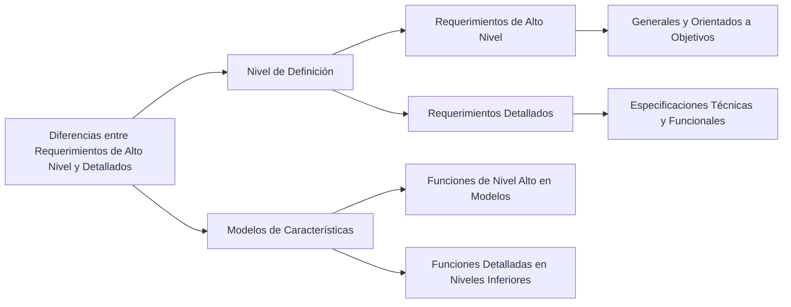

Las diferencias entre los requerimientos de alto nivel y los requerimientos detallados en proyectos de software son las siguientes:

1. **Nivel de Definición**:
   - **Requerimientos de Alto Nivel**: Se escriben desde el punto de vista del usuario, cliente o interesado y generalmente no poseen un alto nivel de detalle. Estos requerimientos son más generales y cercanos al stakeholder, capturando el alcance general y los objetivos del proyecto【96†source】.
   - **Requerimientos Detallados**: Desarrollan la definición de los requerimientos de alto nivel de forma más detallada. Contienen respuestas específicas a preguntas sobre qué características debe poseer un sistema para alcanzar los objetivos definidos【96†source】.

2. **Modelos de Características**:
   - En los **modelos de alto nivel**, las características se organizan en grupos, capturando todo el alcance de un proyecto en un modelo. En estos modelos, las funciones de nivel más alto se muestran en el primer nivel (L1), proporcionando una visión general y abarcando las necesidades globales del proyecto【97†source】.
   - Los **niveles inferiores** (L2, L3, etc.) en estos modelos de características representan descomposiciones jerárquicas de estas características en funciones más detalladas y específicas, orientadas a necesidades particulares de los usuarios y aspectos técnicos del sistema【97†source】.

### Desarrollo
Los requerimientos de alto nivel se enfocan en definir la dirección general y los objetivos del proyecto, mientras que los requerimientos detallados se centran en las especificaciones técnicas y funcionales concretas. La transición de alto nivel a detallado implica un proceso de refinamiento y especificación, donde los objetivos generales se traducen en características y funcionalidades específicas.

### Mindmap

### Ejemplo
En un proyecto para desarrollar una aplicación de comercio electrónico, un requerimiento de alto nivel podría ser "la aplicación debe ofrecer una experiencia de usuario segura y eficiente". Un requerimiento detallado derivado de este podría ser "la aplicación debe implementar un proceso de pago que no exceda los tres pasos y use encriptación SSL".

### Glosario
- **Requerimientos de Alto Nivel**: Requerimientos generales que definen los objetivos y el alcance del proyecto.
- **Requerimientos Detallados**: Requerimientos específicos que detallan las funcionalidades y características técnicas que debe tener el sistema.