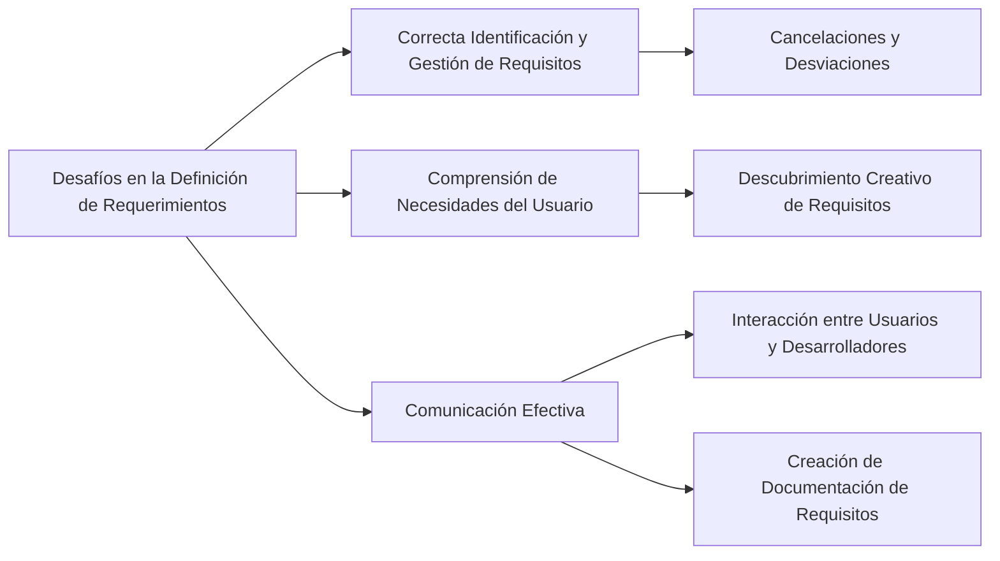

Los desafíos comunes al definir requerimientos en proyectos de software son variados y significativos:

1. **Correcta Identificación y Gestión de Requisitos**: Los proyectos a menudo enfrentan desafíos debido a la incorrecta identificación y gestión de los requisitos. Estos problemas pueden llevar a cancelaciones de proyectos, desviaciones en plazos y presupuestos【42†source】.

2. **Comprensión de las Necesidades del Usuario**: A menudo los usuarios no saben exactamente lo que necesitan, lo que requiere un esfuerzo considerable para descubrir y definir los requisitos. Esto implica abrirse a nuevas ideas, aplicar esfuerzo creativo, trabajar en equipo y hacer preguntas que guíen la búsqueda【43†source】.

3. **Comunicación Efectiva**: La comunicación efectiva entre desarrolladores y usuarios es crucial. Los usuarios deben usar su propio vocabulario para expresar las necesidades del negocio, y los desarrolladores deben aprender sobre el negocio y sus objetivos. Además, se espera que los desarrolladores escriban especificaciones o documentos de los requisitos del software, lo cual es un entregable clave de la ingeniería de requerimientos【44†source】.

### Desarrollo
Estos desafíos subrayan la importancia de una colaboración efectiva y de procesos bien establecidos en la ingeniería de requerimientos. La capacidad de adaptarse a las necesidades cambiantes y de comunicar eficazmente estas necesidades entre los distintos stakeholders es fundamental para el éxito del proyecto.

### Mindmap

### Ejemplo
En un proyecto para desarrollar una aplicación de comercio electrónico, un desafío común podría ser entender las necesidades de varios tipos de usuarios: compradores, vendedores y administradores del sitio. Cada grupo puede tener requisitos diferentes y no siempre expresarlos claramente, requiriendo un esfuerzo significativo para descubrir y documentar estos requisitos de manera efectiva.

### Glosario
- **Identificación de Requisitos**: Proceso de determinar las necesidades y expectativas de los stakeholders de un proyecto.
- **Gestión de Requisitos**: Control y seguimiento de los requisitos durante todo el ciclo de vida del proyecto.
- **Comunicación Efectiva**: Habilidad de intercambiar información de manera clara y comprensible entre todas las partes interesadas.