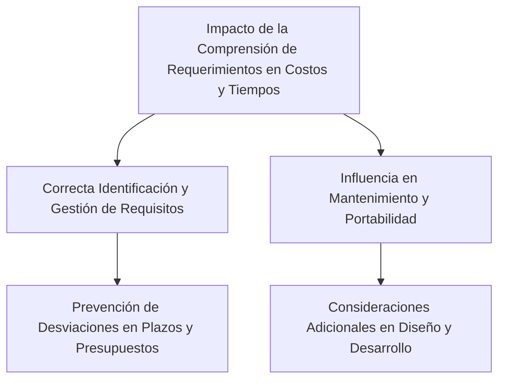

# ¿Cómo afecta la comprensión de los requerimientos a la estimación de costos y tiempos en un proyecto?
La comprensión de los requerimientos tiene un impacto directo y significativo en la estimación de costos y tiempos en un proyecto de software:

1. **Relación con Costos y Tiempos de Desarrollo**: La correcta identificación y gestión de los requerimientos son cruciales para el éxito de un proyecto. Estudios han mostrado que muchos proyectos de software fracasan o presentan desviaciones significativas en plazos y presupuestos iniciales debido a una gestión inadecuada de los requerimientos. Una comprensión precisa de los requerimientos ayuda a prevenir estas desviaciones, permitiendo una estimación más precisa de los costos y tiempos necesarios para el desarrollo.

2. **Influencia en la Capacidad de Mantenimiento y Portabilidad**: Los requerimientos no funcionales, como la portabilidad y la capacidad de mantenimiento, también afectan la estimación de esfuerzos y recursos. Por ejemplo, la necesidad de que una aplicación se ejecute en múltiples entornos (como diferentes sistemas operativos y dispositivos) implica consideraciones adicionales en términos de diseño, desarrollo y pruebas, lo cual puede influir en la estimación de costos y plazos.

### Desarrollo
Una comprensión clara y detallada de los requerimientos permite planificar de manera más efectiva los recursos, tiempo y costos necesarios para el desarrollo y mantenimiento del software, reduciendo el riesgo de desviaciones y fracasos del proyecto.

### Mindmap

### Ejemplo
En un proyecto para desarrollar una aplicación de comercio electrónico, una comprensión clara de requerimientos como la integración con múltiples sistemas de pago y la compatibilidad con distintos dispositivos móviles permitiría una planificación más precisa en términos de esfuerzos de desarrollo, pruebas y presupuesto.

### Glosario
- **Gestión de Requerimientos**: Proceso de documentar, analizar, rastrear, priorizar y acordar los requisitos de un proyecto, y luego controlar los cambios en ellos.
- **Estimación de Costos y Tiempos**: Proceso de predecir los recursos y el tiempo necesarios para completar un proyecto de software.