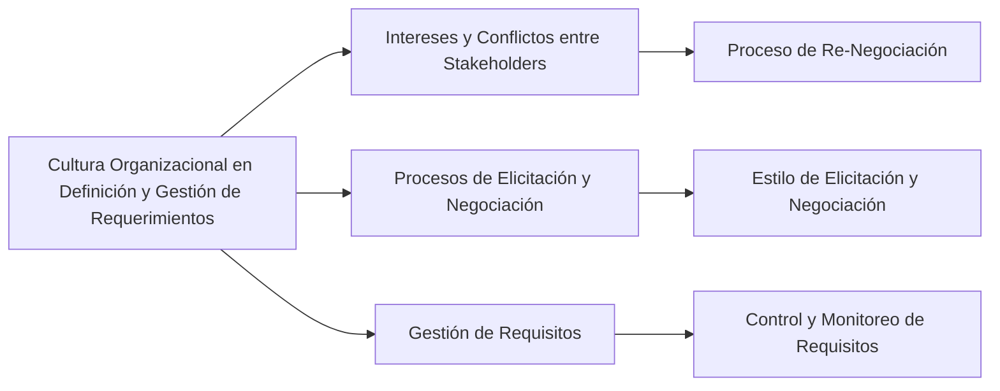

# ¿Cómo impacta la cultura organizacional en la definición y gestión de requerimientos?
La cultura organizacional tiene un impacto significativo en la definición y gestión de requerimientos en proyectos de software. Algunos aspectos clave son:

1. **Intereses y Conflictos entre Stakeholders**: En una organización, diferentes individuos pueden tener intereses distintos e incluso enfrentados. Estos conflictos deben abordarse a través de un proceso de (re)negociación para consensuar los requisitos entre clientes y usuarios. La forma en que se manejan estos conflictos está fuertemente influenciada por la cultura organizacional【82†source】.

2. **Procesos de Elicitación y Negociación**: La cultura organizacional afecta cómo se lleva a cabo la elicitación de requerimientos. En algunas organizaciones, este proceso puede ser más colaborativo y abierto, mientras que en otras puede ser más rígido y formal. La negociación de los requerimientos también depende de la cultura organizacional, especialmente después de la primera iteración de elicitación, donde es común negociar entre los distintos participantes para obtener una visión común de los requisitos.

3. **Gestión de Requisitos**: La cultura organizacional influye en cómo se controlan y monitorean los requisitos del producto y del proceso después de ser descubiertos. Esto incluye la identificación de inconsistencias entre los requisitos y el plan de proyecto, y cómo se abordan estas inconsistencias.

### Desarrollo
La cultura organizacional determina cómo se comunican y colaboran los diferentes stakeholders, cómo se manejan los conflictos y desacuerdos, y cómo se priorizan y negocian los requisitos. Una cultura abierta y colaborativa puede facilitar un proceso más fluido y eficiente en la definición y gestión de requerimientos, mientras que una cultura más cerrada y jerárquica puede presentar desafíos adicionales.

### Mindmap

### Ejemplo
En una empresa de software con una cultura organizacional abierta y colaborativa, los equipos de desarrollo y los usuarios finales podrían trabajar juntos en talleres de elicitación de requerimientos, compartiendo ideas y negociando soluciones. En cambio, en una empresa con una cultura más jerárquica, los requerimientos podrían definirse principalmente por la alta gerencia, con menos participación directa de los usuarios finales.

### Glosario
- **Elicitación de Requerimientos**: Proceso de recolectar los requisitos de un sistema a través de la consulta con los stakeholders.
- **Negociación de Requerimientos**: Proceso de llegar a un acuerdo común entre los stakeholders sobre los requisitos del sistema.
- **Gestión de Requisitos**: Proceso de documentar, analizar, trazar, priorizar y acordar los requisitos, y luego controlar los cambios y comunicarlos a los stakeholders relevantes.