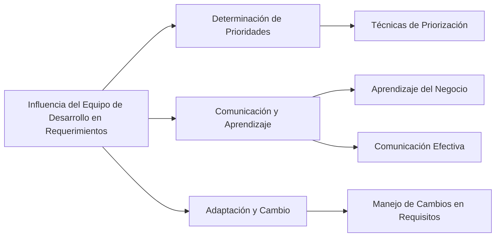

# ¿Cómo influye el equipo de desarrollo en la definición de requerimientos?

El equipo de desarrollo juega un papel crucial en la definición de requerimientos en proyectos de software de varias maneras:

1. **Determinación de Prioridades**: Los desarrolladores pueden influir en la priorización de ciertas funciones, incluso si inicialmente se consideran de baja prioridad, debido a su impacto en la arquitectura del producto. Utilizan métodos controlados y una variedad de técnicas para asignar prioridades a los requisitos.

2. **Comunicación y Aprendizaje**: Se espera que los desarrolladores aprendan sobre el negocio y sus objetivos, lo cual es fundamental para entender los requisitos. Además, deben ser capaces de comunicarse efectivamente con los stakeholders, manteniendo una actitud colaborativa y profesional.

3. **Adaptación y Cambio**: Durante el ciclo de vida de un proyecto, los requisitos pueden cambiar a medida que se van incorporando nuevos o modificando los existentes. Los desarrolladores deben estar preparados para adaptarse a estos cambios y comprender que los mismos pueden mejorar la calidad y aceptación del sistema, aunque tengan un costo.

La implicación del equipo de desarrollo en la definición de requerimientos es dinámica y requiere una constante adaptación y colaboración. Los desarrolladores no solo implementan los requisitos, sino que también contribuyen a su definición y refinamiento a lo largo del proyecto.

### Mindmap

### Ejemplo
En el desarrollo de un sistema de gestión de inventario, el equipo de desarrollo puede sugerir priorizar la integración con sistemas existentes debido a su impacto en la arquitectura general del sistema. Además, deben aprender sobre las operaciones del negocio para entender mejor cómo los usuarios interactuarán con el sistema, y estar preparados para adaptar los requisitos a medida que surjan nuevas necesidades o restricciones.

### Glosario
- **Priorización de Requisitos**: Proceso de decidir la importancia relativa de diferentes requisitos en un proyecto.
- **Comunicación Efectiva**: Intercambio de información de manera clara y comprensible entre todas las partes interesadas.
- **Adaptación a Cambios**: Capacidad de modificar los requisitos y el diseño del sistema en respuesta a nuevas informaciones o cambios en el entorno del proyecto.

### Evaluación

[Evaluación](https://colab.research.google.com/github/IngenieriaDeRequerimientosDaVinci/preguntas/blob/main/Unidad%201/C%C3%B3mo%20influye%20el%20equipo%20de%20desarrollo%20en%20la%20definici%C3%B3n%20de%20requerimientos/Evaluador.ipynb)

