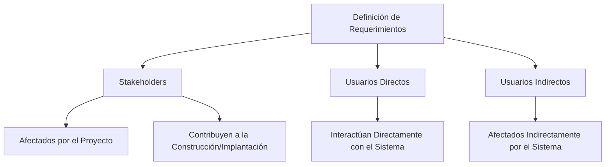

# ¿Cómo se diferencian los stakeholders, usuarios directos e indirectos en el proceso de definición de requerimientos?

En el proceso de definición de requerimientos para el desarrollo de software, los términos "stakeholders", "usuarios directos" e "indirectos" tienen significados específicos y roles distintos:

1. **Stakeholders**: Son todas las personas o entidades que pueden verse afectadas por el proyecto o que tienen algo que decir durante su construcción o implantación. Esto incluye no solo a los usuarios del sistema, sino también a personas que tienen interés en el sistema pero no lo utilizarán, como gestores o piratas informáticos, así como instituciones gubernamentales o legales.

### Desarrollo
- **Usuarios Directos**: Son aquellos que interactuarán directamente con el sistema. Esto incluye a usuarios finales que operan o administran el sistema en su uso cotidiano.
- **Usuarios Indirectos**: Aunque no interactúan directamente con el sistema, se ven afectados por su operación y resultados. Por ejemplo, clientes de una empresa que utiliza un sistema de CRM (gestión de relaciones con clientes) se ven indirectamente afectados por la eficiencia y eficacia del sistema.

### Mindmap

### Ejemplo
En un proyecto de desarrollo de un sistema de reservas para un hotel:
- **Stakeholder**: El gerente del hotel (influye en los requisitos del sistema).
- **Usuario Directo**: Recepcionista que utiliza el sistema para gestionar reservas.
- **Usuario Indirecto**: Los huéspedes que experimentan una reserva más eficiente aunque no interactúan directamente con el sistema.

### Glosario
- **Stakeholder**: Individuos o entidades que tienen un interés o son afectados por un proyecto.
- **Usuario Directo**: Persona que interactúa directamente con un sistema o producto.
- **Usuario Indirecto**: Persona que se ve afectada por el uso de un sistema o producto, aunque no interactúa directamente con él.

### Evaluación

[Evaluación](https://colab.research.google.com/github/IngenieriaDeRequerimientosDaVinci/preguntas/blob/main/Unidad%201/C%C3%B3mo%20se%20diferencian%20los%20stakeholders%2C%20usuarios%20directos%20e%20indirectos%20en%20el%20proceso%20de%20definici%C3%B3n%20de%20requerimientos/Evaluador.ipynb)