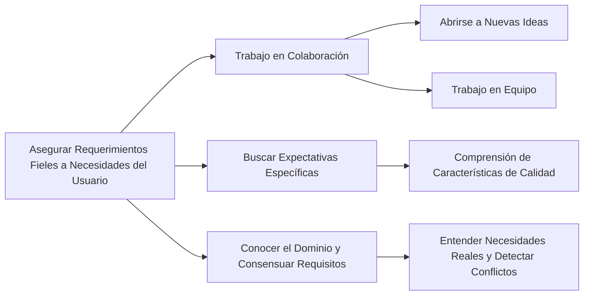

# ¿Cómo se puede asegurar que los requerimientos reflejen fielmente las necesidades del usuario?

Para asegurar que los requerimientos reflejen fielmente las necesidades del usuario en proyectos de software, es crucial seguir un proceso detallado y colaborativo:

1. **Trabajo en Colaboración**: Es esencial trabajar en colaboración con los usuarios y stakeholders, abriéndose a nuevas ideas, aplicando esfuerzo creativo, trabajando en equipo y haciendo preguntas que guíen la búsqueda de requisitos. Este enfoque ayuda a descubrir necesidades que no son evidentes inicialmente【66†source】.

2. **Buscar Expectativas Específicas**: Durante la fase de descubrimiento de los requisitos, es importante prestar atención a los comentarios de los usuarios, ya que pueden proporcionar pistas sobre las características de calidad que tienen en mente para el producto. Los analistas deben realizar preguntas específicas para comprender mejor las necesidades relacionadas con aspectos como la interoperabilidad y seguridad【67†source】.

3. **Conocer el Dominio y Consensuar Requisitos**: Entender el dominio del problema, descubrir las necesidades reales de los clientes y usuarios, y consensuar los requisitos son pasos fundamentales. Esto implica también detectar posibles conflictos y establecer las bases para el diseño del sistema【68†source】.

### Desarrollo
Este proceso implica una comprensión profunda no solo de lo que los usuarios dicen que necesitan, sino también de lo que realmente requieren para sus actividades y objetivos. La colaboración, la comunicación efectiva y el análisis detallado son clave para lograr que los requerimientos reflejen fielmente estas necesidades.

### Mindmap

### Ejemplo
En un proyecto para desarrollar un sistema de gestión de citas médicas, el equipo podría organizar talleres con médicos y pacientes para entender sus necesidades. Preguntarían sobre aspectos específicos como la facilidad de uso, la privacidad y la rapidez de respuesta del sistema. Además, analizarían el flujo de trabajo actual en las clínicas para identificar y consensuar los requisitos del nuevo sistema.

### Glosario
- **Colaboración**: Trabajo conjunto entre diferentes partes interesadas para alcanzar un objetivo común.
- **Consensuar Requisitos**: Proceso de llegar a un acuerdo entre todas las partes interesadas sobre los requisitos del sistema.
- **Dominio del Problema**: Entorno y contexto específico en el que se desarrolla y opera un sistema.

### Evaluación

[Evaluación](https://colab.research.google.com/github/IngenieriaDeRequerimientosDaVinci/preguntas/blob/main/Unidad%201/C%C3%B3mo%20se%20puede%20asegurar%20que%20los%20requerimientos%20reflejen%20fielmente%20las%20necesidades%20del%20usuario/Evaluador.ipynb)