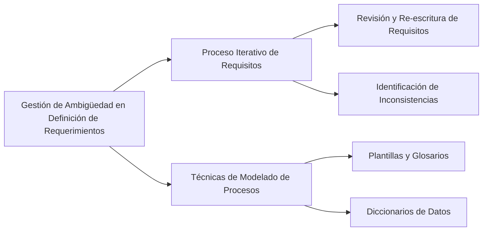

Para gestionar la ambigüedad en la definición inicial de requerimientos, se pueden seguir estas estrategias:

1. **Proceso Iterativo de Requisitos**: Reconocer que los requisitos pueden definirse inicialmente con cierto grado de ambigüedad y que es normal en las primeras etapas del proyecto. Importante es que en sucesivas revisiones se elimine esta ambigüedad reescribiendo los requisitos. Un requisito no ambiguo de forma individual puede volverse ambiguo al relacionarse con otros, por lo que es esencial revisarlos en el contexto de la especificación completa para identificar y resolver inconsistencias【103†source】.

2. **Técnicas de Modelado de Procesos**: Utilizar lenguajes de modelado puede ayudar a solventar problemas de ambigüedad que surgen con el lenguaje natural. Herramientas como plantillas y glosarios, que formalizan la recogida de información y restringen los campos a rellenar, son útiles para clarificar los requisitos. Además, los diccionarios de datos ayudan a definir y aclarar términos y conceptos utilizados en los requisitos【104†source】.

### Desarrollo
Estas estrategias son esenciales para evitar malentendidos y errores que pueden surgir de la ambigüedad en los requisitos. Un enfoque claro, estructurado y revisable para la definición de requerimientos es crucial para el éxito del proyecto.

### Mindmap

### Ejemplo
En un proyecto para desarrollar una aplicación de seguimiento de ejercicios, un requerimiento inicialmente ambiguo podría ser "la aplicación debe ofrecer seguimiento avanzado de actividades". Durante las revisiones, este requerimiento se puede especificar más claramente, como "la aplicación debe permitir a los usuarios registrar y visualizar métricas específicas para cada tipo de actividad, incluyendo duración, distancia y calorías quemadas".

### Glosario
- **Proceso Iterativo de Requisitos**: Método de desarrollo de requisitos que implica su revisión y ajuste continuos a lo largo del tiempo.
- **Modelado de Procesos**: Técnicas que utilizan representaciones gráficas o formales para definir y analizar los procesos y requisitos de un sistema.