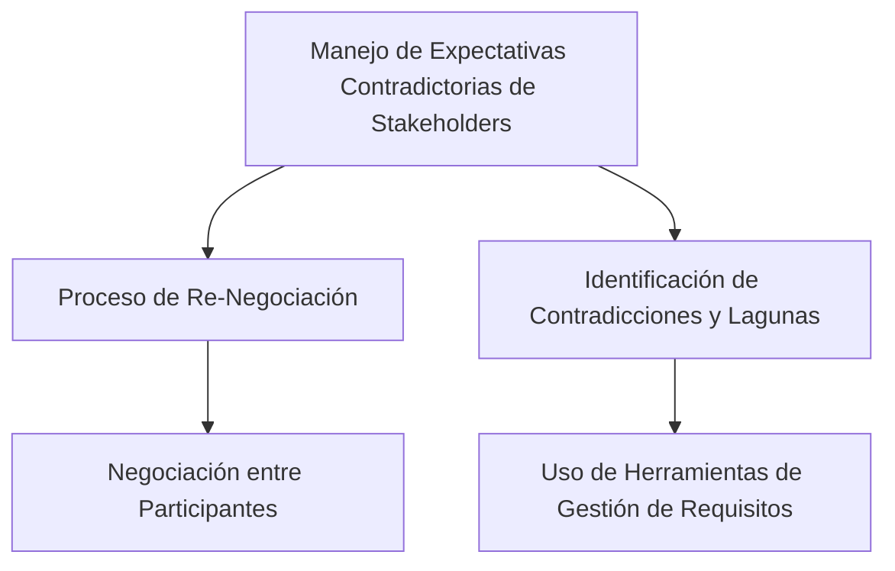

Para identificar y gestionar las expectativas contradictorias de diferentes stakeholders en el proceso de definición de requerimientos, se pueden seguir estas estrategias:

1. **Proceso de (Re)Negociación**: Cuando intervienen distintos individuos con intereses a veces enfrentados, es esencial un proceso de (re)negociación. Los conflictos no deben resolverse unilateralmente sino a través de la negociación para consensuar los requisitos entre los diferentes stakeholders. Es común que después de la primera iteración de la elicitación sea necesario negociar entre los distintos participantes para obtener una visión común de los requisitos【120†source】.

2. **Identificación de Contradicciones y Lagunas**: Es importante identificar situaciones donde diferentes grupos de clientes y usuarios presenten necesidades contradictorias. Esto implica también identificar las lagunas en los requisitos o bien los requisitos innecesarios según el contexto y el dominio del proyecto. Para ello, se puede hacer uso de herramientas de software que permitan gestionar de manera organizada el conocimiento sobre los requisitos recolectados【121†source】.

### Desarrollo
Estas estrategias ayudan a asegurar que los requisitos del proyecto reflejen un entendimiento integral y equilibrado de las necesidades y expectativas de todos los stakeholders, lo cual es crucial para el éxito del proyecto.

### Mindmap

### Ejemplo
En un proyecto para desarrollar un sistema de gestión de recursos humanos, los directivos pueden enfocarse en la eficiencia de costos, mientras que los empleados pueden priorizar la facilidad de uso y la privacidad. La gestión de estas expectativas contradictorias implicaría reuniones de negociación y el uso de herramientas de software para documentar y equilibrar estas necesidades diversas.

### Glosario
- **(Re)Negociación**: Proceso de discusión y acuerdo entre stakeholders para resolver diferencias y alcanzar un entendimiento común.
- **Herramientas de Gestión de Requisitos**: Software o métodos utilizados para documentar, analizar y rastrear requisitos.