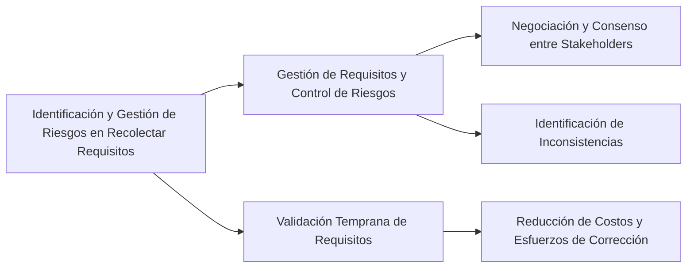

La identificación y gestión de riesgos desde la fase inicial de recolección de requerimientos son cruciales para el éxito de un proyecto de software:

1. **Gestión de Requisitos y Control de Riesgos**: La gestión de requisitos incluye el control y monitoreo de todos los requisitos del producto y del proceso después de ser descubiertos. Esto implica identificar las inconsistencias entre los requisitos y el plan de proyecto, lo cual es una actividad clave para mitigar riesgos. Durante la elicitación de requisitos, es fundamental negociar entre los distintos participantes para obtener una visión común y consensuada de los requisitos, lo cual ayuda a identificar y gestionar posibles conflictos y riesgos desde el inicio【163†source】.

2. **Importancia de la Validación Temprana de Requisitos**: La corrección temprana de errores en los requisitos es mucho menos costosa y menos riesgosa que la corrección en etapas posteriores. Por ejemplo, corregir un error en la fase de estudio de los requisitos puede llevar alrededor de 30 minutos, mientras que si ese error persiste y se debe corregir en la fase de pruebas, puede requerir entre 5 y 17 horas de esfuerzo. Por lo tanto, es esencial dedicar tiempo y esfuerzo a la validación de los requisitos para reducir riesgos y costes asociados con errores no detectados【164†source】.

### Desarrollo
Una gestión de requisitos eficaz y una validación temprana son esenciales para identificar riesgos potenciales y mitigarlos eficientemente, lo que contribuye a mantener el proyecto en el camino correcto y dentro de los límites de coste y tiempo previstos.

### Mindmap

### Ejemplo
En un proyecto para el desarrollo de un sistema de gestión hospitalaria, identificar y negociar requisitos relacionados con la privacidad de datos de pacientes desde el inicio puede prevenir problemas legales y técnicos en etapas posteriores. La validación temprana de estos requisitos con los stakeholders asegura que se identifiquen y aborden adecuadamente los riesgos asociados.

### Glosario
- **Gestión de Requisitos**: Proceso de documentar, analizar, rastrear, priorizar y acordar los requisitos, y luego controlar los cambios en ellos.
- **Validación de Requisitos**: Proceso de confirmar que los requisitos documentados satisfacen las necesidades y expectativas de los usuarios y stakeholders.