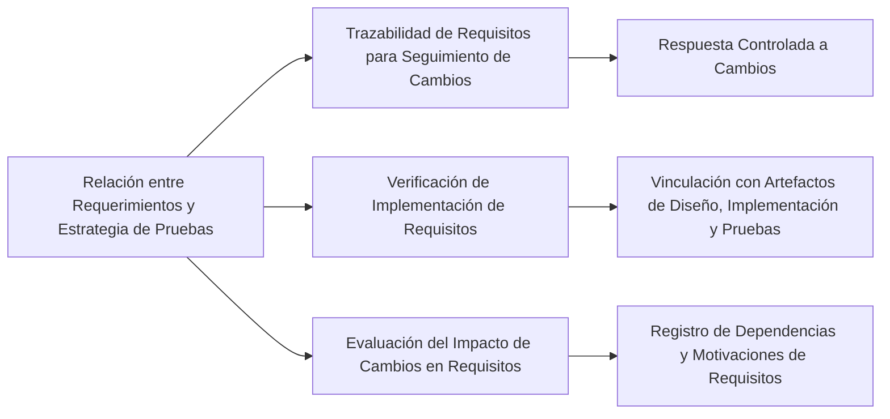

# ¿Cómo se relacionan los requerimientos con la estrategia de pruebas en un proyecto de software?

La relación entre los requerimientos y la estrategia de pruebas en un proyecto de software se establece principalmente a través de la trazabilidad de requisitos:

1. **Trazabilidad de Requisitos para Seguimiento de Cambios**: La trazabilidad de requisitos permite realizar el seguimiento de cada cambio que se realice sobre un requisito. Al trazar los requisitos con otros artefactos como pruebas, casos de uso y código, es posible responder a los cambios de manera más controlada y con más información. Esto facilita la anticipación de lo que un cambio puede significar y cómo afectará al sistema.

2. **Verificación de la Implementación de Requisitos**: La trazabilidad también ayuda a verificar si un requisito ha sido implementado en el sistema. Esto implica comprobar si alguna propiedad del sistema cumple con lo especificado en los requisitos. La trazabilidad permite vincular los requisitos con los artefactos de diseño, implementación y pruebas, asegurando que cada requisito se refleje adecuadamente en el producto final.

3. **Evaluación del Impacto de Cambios en Requisitos**: La trazabilidad entre requisitos es crucial para evaluar cómo un cambio propuesto afectará a muchos requisitos y la magnitud de los cambios consecuentes en ellos. Registrar las dependencias de los requisitos en el momento de su especificación ayuda a entender la motivación detrás de cada requisito y sus interrelaciones con otros productos del proyecto.

### Desarrollo
Utilizar la trazabilidad de requisitos en la estrategia de pruebas garantiza que los cambios en los requisitos se reflejen adecuadamente en el plan de pruebas y que el software final cumpla con los requisitos especificados. Esto conduce a un desarrollo de software más eficiente y a un producto final que satisface las necesidades de los usuarios.

### Mindmap

### Ejemplo
En un proyecto para desarrollar un sistema de reservas de hotel, la trazabilidad de requisitos ayudaría a asegurar que las pruebas cubran todas las funcionalidades importantes, como la búsqueda de habitaciones disponibles, la reserva y la cancelación. Cualquier cambio en estos requisitos podría ser rápidamente identificado y reflejado en el plan de pruebas.

### Glosario
- **Trazabilidad de Requisitos**: Proceso de documentar y seguir la vida de un requisito en todas las fases del desarrollo de software.
- **Verificación de Requisitos**: Proceso de asegurar que los requisitos se han implementado correctamente en el producto de software.

### Evaluación

[Evaluación](https://colab.research.google.com/github/IngenieriaDeRequerimientosDaVinci/preguntas/blob/main/Unidad%201/C%C3%B3mo%20se%20relacionan%20los%20requerimientos%20con%20la%20estrategia%20de%20pruebas%20en%20un%20proyecto%20de%20software/Evaluador.ipynb)