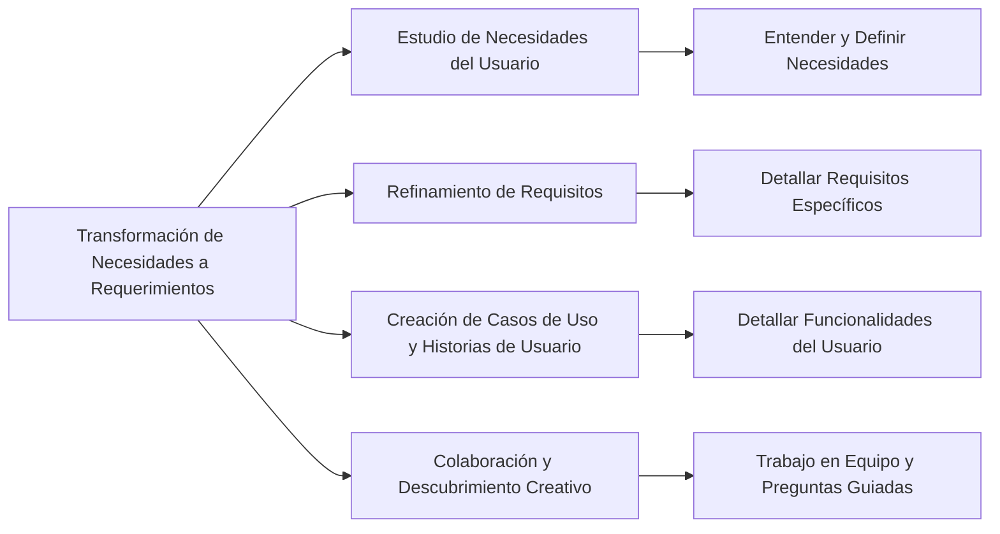

La transformación de una necesidad del usuario en un requerimiento de software es un proceso complejo que forma parte de la ingeniería de requerimientos (InRe). Este proceso incluye:

1. **Estudio de las Necesidades del Usuario**: Implica entender y definir las necesidades o condiciones que deben satisfacerse, lo que incluye tanto requisitos de sistema de hardware como de software【28†source】.

2. **Refinamiento de Requisitos**: Una vez identificadas, estas necesidades se estudian y refinan para convertirlas en requisitos específicos del sistema【28†source】.

3. **Creación de Casos de Uso y Historias de Usuario**: Estos elementos ayudan a detallar lo que el usuario será capaz de hacer con el sistema, proporcionando una visión más clara de los requisitos necesarios【29†source】.

4. **Colaboración y Descubrimiento Creativo**: No siempre los usuarios saben exactamente lo que necesitan. La identificación de requisitos implica trabajar en colaboración, abrirse a nuevas ideas, aplicar esfuerzo creativo, trabajar en equipo y hacer preguntas que guíen la búsqueda de soluciones adecuadas【30†source】.

### Desarrollo
Este proceso es iterativo y colaborativo, involucrando a diferentes stakeholders. Requiere un entendimiento profundo de las necesidades del usuario, así como la capacidad de traducir estas necesidades en especificaciones técnicas que puedan ser implementadas en el software.

### Mindmap

### Ejemplo
Imaginemos que se desea desarrollar una aplicación de pedidos de comida a domicilio. Inicialmente, los usuarios pueden expresar la necesidad de "ordenar comida fácilmente". A través de la ingeniería de requerimientos, esta necesidad se traduce en requisitos concretos como "la aplicación debe permitir a los usuarios seleccionar restaurantes, elegir platos y realizar pagos en línea".

### Glosario
- **Casos de Uso**: Descripciones de cómo un usuario interactuará con un sistema para lograr un objetivo específico.
- **Historias de Usuario**: Breves descripciones de una característica o funcionalidad del sistema desde la perspectiva del usuario final.
- **Refinamiento de Requisitos**: Proceso de detallar y clarificar los requisitos iniciales para asegurarse de que sean completos y realizables.