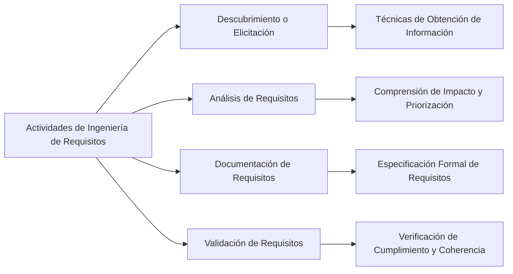

Las actividades asociadas a la ingeniería de requerimientos (InRe) son esenciales para el proceso de desarrollo de software. Estas actividades incluyen:

1. **Descubrir o Elicitar (Elicitation)**: Utilización de diferentes técnicas para obtener información sobre los requisitos de los stakeholders【36†source】.

### Desarrollo
- **Análisis de Requisitos**: Después de la elicitar, los requisitos deben ser analizados para comprender su impacto, viabilidad y priorización.
- **Documentación de Requisitos**: Los requisitos recopilados y analizados se documentan en una especificación formal.
- **Validación de Requisitos**: Se verifica que los requisitos documentados cumplan con las necesidades y expectativas de los usuarios y sean coherentes con los objetivos del sistema.

### Mindmap

### Ejemplo
Consideremos el desarrollo de un software de contabilidad empresarial:
- **Elicitación**: Realizar entrevistas y encuestas con contadores y gerentes financieros para identificar sus necesidades.
- **Análisis**: Determinar la prioridad de los requisitos como la generación de informes financieros automatizados.
- **Documentación**: Escribir una especificación detallada de las funcionalidades requeridas.
- **Validación**: Revisar los requisitos con los usuarios finales para asegurarse de que satisfagan sus necesidades.

### Glosario
- **Elicitación**: Proceso de recolección de requisitos a través de la comunicación con los stakeholders.
- **Análisis de Requisitos**: Evaluación y priorización de los requisitos recopilados.
- **Documentación de Requisitos**: Registro formal de los requisitos de un sistema.
- **Validación de Requisitos**: Confirmación de que los requisitos satisfacen las necesidades y expectativas de los usuarios.