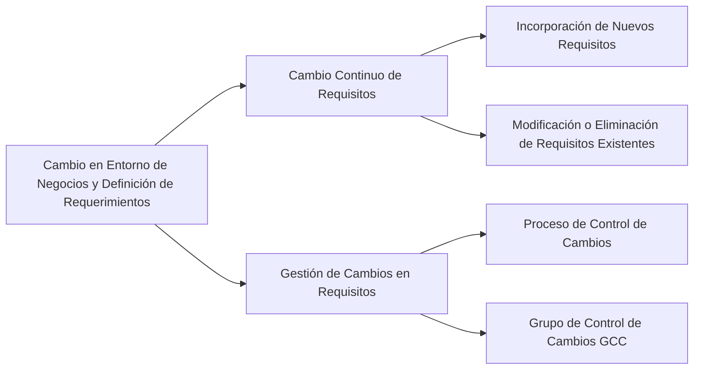

# Pregunta

## ¿De qué manera los cambios en el entorno de negocios afectan la definición de requerimientos?

Los cambios en el entorno de negocios afectan la definición de requerimientos de un proyecto de software de las siguientes maneras:

1. **Cambio Continuo de Requisitos**: A lo largo del ciclo de vida de un proyecto, los requisitos del sistema pueden cambiar a medida que se incorporan nuevos requisitos, se modifican los existentes o incluso se eliminan. Estos cambios pueden deberse a la evolución en el aprendizaje y comprensión de los stakeholders sobre el sistema, a medida que avanzan las tareas de Ingeniería de Requisitos. Como resultado, pueden aparecer nuevos requisitos o cambiar los existentes. Aunque estos cambios pueden mejorar la calidad y la aceptación del sistema, también tienen un costo asociado, especialmente si implican modificaciones significativas en el diseño o la implementación.

2. **Gestión de Cambios en Requisitos**: El manejo de estos cambios requiere un proceso estructurado, como el establecimiento de un Grupo de Control de Cambios (GCC). Este grupo es responsable de revisar los cambios propuestos en los requisitos y asegurar que cada petición de cambio sea considerada, autorizada y coordinada de forma adecuada. El proceso de control de cambios incluye el análisis de la solicitud, la valoración del cambio, el análisis de modificaciones y la documentación del cambio una vez que ha sido aceptado y desarrollado en el proyecto.

Estos aspectos subrayan la importancia de una gestión flexible y adaptativa de los requerimientos en respuesta a los cambios en el entorno de negocios, asegurando que el proyecto de software siga siendo relevante y alineado con las necesidades actuales del mercado y los usuarios.

### Mindmap

### Ejemplo
En un proyecto para desarrollar una aplicación de banca digital, la introducción de nuevas regulaciones financieras y las expectativas cambiantes de los usuarios pueden requerir la adición de nuevos requisitos de seguridad y privacidad, o la modificación de funciones existentes. La gestión efectiva de estos cambios es crucial para mantener la relevancia y cumplimiento del proyecto.

### Glosario
- **Grupo de Control de Cambios**: Grupo encargado de revisar y autorizar cambios en los requisitos de un proyecto de software.
- **Ingeniería de Requisitos**: Proceso de definición, documentación y mantenimiento de los requisitos en un proyecto de software.

### Evaluación

[Evaluación](https://colab.research.google.com/github/IngenieriaDeRequerimientosDaVinci/preguntas/blob/main/Unidad%201/De%20qu%C3%A9%20manera%20los%20cambios%20en%20el%20entorno%20de%20negocios%20afectan%20la%20definici%C3%B3n%20de%20requerimientos/Evaluador.ipynb)