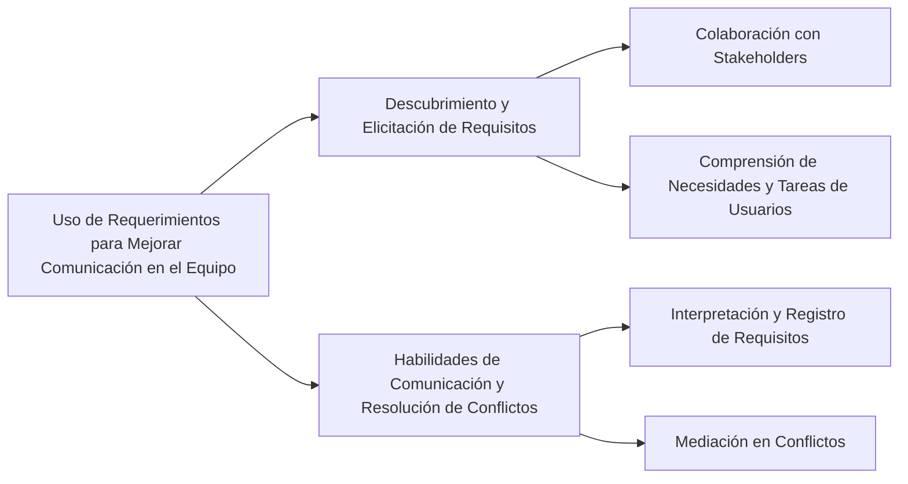

Los requerimientos pueden utilizarse para mejorar la comunicación dentro del equipo de desarrollo de varias maneras:

1. **Facilitar el Descubrimiento y la Elicitación de Requisitos**: La elicitación de requisitos no es solo una actividad técnica, sino también humana. Implica identificar a los stakeholders y establecer relaciones iniciales con ellos. Este proceso debe ser colaborativo, no pasivo, y se centra en cómo los desarrolladores descubren y recopilan los requisitos. La comunicación efectiva en esta etapa es crucial, ya que a menudo los usuarios pueden tener dificultades para describir sus tareas o necesidades de manera clara【142†source】.

2. **Habilidades de Comunicación y Resolución de Conflictos**: Para interpretar y registrar correctamente los requisitos de los stakeholders, es esencial ser comunicativo. Esto incluye escuchar activamente, hacer preguntas pertinentes y observar para captar información que puede no estar claramente expresada. Además, la resolución de conflictos es importante cuando diferentes stakeholders tienen opiniones diversas. El ingeniero de requisitos debe identificar estos conflictos y mediar entre las partes implicadas, utilizando técnicas de resolución de conflictos y actuando como moderador en discusiones y talleres【143†source】.

### Desarrollo
Utilizar los requerimientos de esta manera ayuda a crear un entendimiento común entre todos los miembros del equipo y los stakeholders, facilitando una colaboración efectiva y reduciendo malentendidos o conflictos.

### Mindmap

### Ejemplo
En un proyecto para desarrollar un nuevo sistema de gestión de inventario, el proceso de elicitación de requisitos podría incluir talleres con el equipo de logística y ventas para comprender sus necesidades específicas. Las habilidades de comunicación y resolución de conflictos serían cruciales para abordar cualquier discrepancia o malentendido entre estos departamentos sobre las funcionalidades necesarias.

### Glosario
- **Elicitación de Requisitos**: Proceso de recolectar los requisitos de un sistema a través de la consulta con los stakeholders.
- **Resolución de Conflictos**: Habilidades y técnicas utilizadas para resolver desacuerdos y llegar a un consenso entre partes con opiniones diferentes.