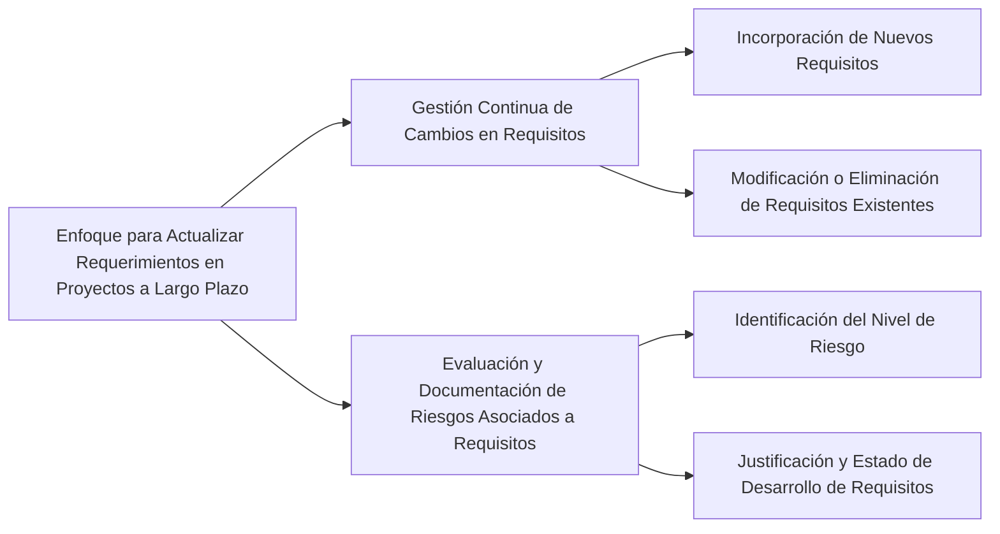

Para actualizar los requerimientos en proyectos a largo plazo, se recomienda un enfoque flexible y dinámico que tenga en cuenta los siguientes aspectos:

1. **Gestión Continua de Cambios en Requisitos**: A lo largo del ciclo de vida del proyecto, es común que los requisitos cambien al incorporar nuevos, modificar los existentes o incluso eliminar algunos. Estos cambios pueden deberse a una variedad de razones, como el aprendizaje y la comprensión evolutiva de los stakeholders sobre el sistema. Aceptar y gestionar estos cambios es crucial, ya que pueden mejorar la calidad y el grado de aceptación del sistema. Sin embargo, es importante ser consciente de que estos cambios tienen un costo asociado, que puede variar dependiendo de la complejidad de las modificaciones necesarias【177†source】.

2. **Evaluación y Documentación de Riesgos Asociados a Requisitos**: Es importante identificar y documentar el nivel de riesgo asociado a cada requisito. Esta evaluación debe ser acordada por los miembros del proyecto y puede incluir el estado actual del requisito (en desarrollo, pendiente de negociación, validado, etc.), así como la justificación de su inclusión. Este proceso ayuda a entender las implicaciones de los cambios en los requisitos y a tomar decisiones informadas sobre cómo y cuándo implementarlos【178†source】.

### Desarrollo
Este enfoque permite una actualización de requerimientos que es sensible a los cambios en el entorno del proyecto y a las necesidades de los stakeholders, mientras se mantienen bajo control los riesgos y costos asociados.

### Mindmap

### Ejemplo
En un proyecto de desarrollo de software para un sistema de gestión empresarial a largo plazo, los cambios en las regulaciones comerciales o las tendencias del mercado pueden requerir la actualización de requisitos relacionados con el procesamiento de datos o la seguridad. La gestión de estos cambios debe incluir la evaluación de riesgos y costos, y debe documentarse adecuadamente para garantizar que todos los stakeholders estén informados y de acuerdo con las modificaciones.

### Glosario
- **Gestión de Cambios en Requisitos**: Proceso de adaptar, modificar o eliminar requisitos en respuesta a cambios internos o externos del proyecto.
- **Evaluación de Riesgos**: Proceso de identificar, analizar y documentar los riesgos asociados con los requisitos de un proyecto.