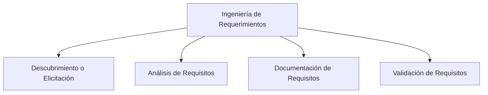

# Pregunta

## ¿Qué es la ingeniería de requerimientos y cuáles son sus etapas principales?

La ingeniería de requerimientos (InRe) es un área clave en el desarrollo de software que incluye todas las actividades del ciclo de vida relacionadas con la identificación, análisis, documentación y validación de los requerimientos del sistema. Las etapas principales de la ingeniería de requerimientos son:

- **Descubrir o Elicitar (Elicitation)**: En esta etapa se utilizan diferentes técnicas para obtener información sobre los requisitos de los stakeholders.

- **Análisis de Requisitos**: Tras su descubrimiento, los requisitos se analizan para entender su impacto y prioridad.
- **Documentación de Requisitos**: Los requisitos identificados y analizados se documentan claramente.
- **Validación de Requisitos**: Se verifica que los requisitos documentados cumplan con las necesidades de los usuarios y sean coherentes con los objetivos del sistema.

### Mindmap

### Ejemplo
En un proyecto para desarrollar una aplicación de banca móvil:
- **Descubrimiento**: Realizar entrevistas con clientes del banco para identificar sus necesidades.
- **Análisis**: Priorizar requisitos como seguridad en transacciones y facilidad de uso.
- **Documentación**: Especificar los requisitos en un documento detallado.
- **Validación**: Revisar los requisitos con los clientes para asegurarse de que coinciden con sus expectativas.

### Glosario
- **Elicitación**: Proceso de recolección de requisitos a través de la comunicación con los stakeholders.
- **Análisis de Requisitos**: Evaluación y priorización de los requisitos recopilados.
- **Documentación de Requisitos**: Registro formal de los requisitos de un sistema.
- **Validación de Requisitos**: Confirmación de que los requisitos satisfacen las necesidades y expectativas de los usuarios.