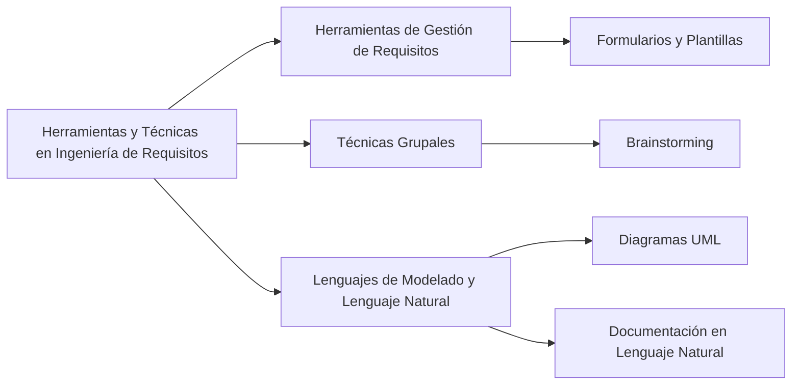

En la ingeniería de requerimientos, se utilizan diversas herramientas y técnicas para facilitar el proceso de definición, gestión y documentación de los requisitos en proyectos de software:

1. **Herramientas de Gestión de Requisitos**: Se utilizan formularios y plantillas para definir las especificaciones de los requisitos. Estas herramientas facilitan la recolección de información y permiten obtener distintas vistas de los requisitos, mejorando aspectos como la trazabilidad【58†source】.

2. **Técnicas Grupales**: Entre ellas, el brainstorming o tormenta de ideas es una técnica común. Se lleva a cabo en reuniones de trabajo con los ingenieros de requisitos y un grupo de stakeholders, con el objetivo de generar ideas en un ambiente libre de críticas【59†source】.

3. **Uso de Lenguajes de Modelado y Lenguaje Natural**: Se emplean diagramas UML, como los de casos de uso, clases, actividades y estados, para representar los diferentes tipos y dimensiones de los requisitos. A su vez, se complementan con el uso de lenguaje natural para documentar los requisitos【60†source】.

### Desarrollo
Estas herramientas y técnicas son fundamentales para asegurar que los requisitos sean bien entendidos, documentados y gestionados a lo largo del ciclo de vida del proyecto de software.

### Mindmap

### Ejemplo
En un proyecto para desarrollar una aplicación móvil de salud, se podrían utilizar plantillas para documentar los requisitos funcionales y no funcionales. Se llevarían a cabo sesiones de brainstorming con médicos y pacientes para generar ideas sobre características y funcionalidades. Además, se emplearían diagramas UML para visualizar el flujo de datos y procesos dentro de la aplicación.

### Glosario
- **Herramientas de Gestión de Requisitos**: Software o métodos utilizados para documentar, analizar y rastrear requisitos.
- **Brainstorming**: Técnica grupal para generar ideas creativas y soluciones a problemas.
- **UML (Unified Modeling Language)**: Lenguaje de modelado estandarizado utilizado para visualizar, especificar, construir y documentar artefactos de sistemas de software.