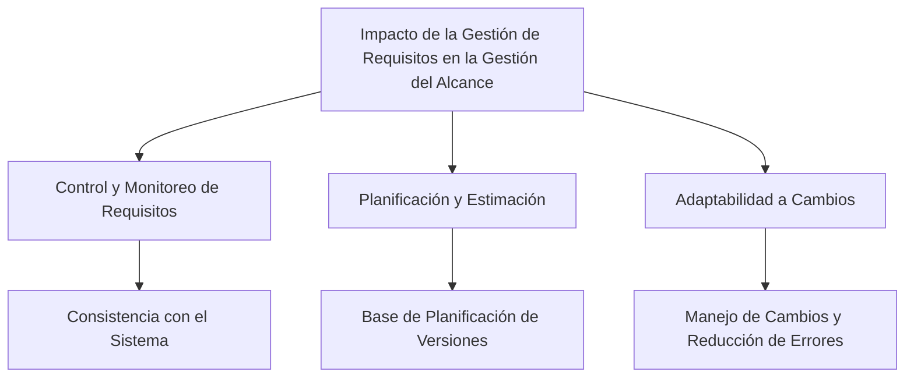

# Pregunta

## ¿Qué impacto tiene la gestión de requerimientos en la gestión del alcance del proyecto?

La gestión de requerimientos tiene un impacto significativo en la gestión del alcance de un proyecto de software:

1. **Control y Monitoreo de Requisitos**: La gestión de requerimientos es un proceso transversal que ayuda al equipo de trabajo a controlar y monitorear los requisitos y sus cambios a lo largo del ciclo de vida del sistema, no solo del proyecto. Asegura la consistencia entre los requisitos y el sistema construido o en construcción.

2. **Base para la Planificación y Estimación**: La gestión de requerimientos es un hito crucial en la gestión del proyecto ya que forma la base de la planificación de versiones y se puede utilizar para estimar el esfuerzo pendiente en el desarrollo. La aceptación de una línea base de requisitos es fundamental y cualquier cambio en esta línea base debe considerarse cuidadosamente, ya que podría afectar significativamente al desarrollo del sistema.

3. **Adaptabilidad a Cambios**: La gestión de requerimientos implica el uso de herramientas que no solo facilitan el mantenimiento de los requisitos, sino que también aportan beneficios como la reducción del número de errores. Los requisitos, una vez determinados y documentados, están sujetos a cambios continuos, y las herramientas de gestión de requisitos proporcionan un medio adecuado para seguir estos cambios durante el ciclo de vida del proyecto.

### Desarrollo
La gestión efectiva de requerimientos es esencial para mantener el alcance del proyecto alineado con los objetivos y expectativas originales, permitiendo al mismo tiempo la flexibilidad necesaria para adaptarse a cambios y nuevos descubrimientos a lo largo del proyecto.

### Mindmap

### Ejemplo
En un proyecto para desarrollar un sistema de reservas en línea, la gestión de requerimientos ayudaría a asegurar que las funcionalidades planeadas (como la búsqueda de disponibilidad y la gestión de reservas) se mantengan alineadas con los objetivos del proyecto, a la vez que permiten ajustes y mejoras basadas en el feedback de los usuarios durante las fases de prueba y desarrollo.

### Glosario
- **Gestión de Requisitos**: Proceso de documentar, analizar, rastrear, priorizar y acordar los requisitos de un proyecto, y luego controlar los cambios en ellos.
- **Gestión del Alcance**: Proceso de definir y controlar lo que está y no está incluido en un proyecto.