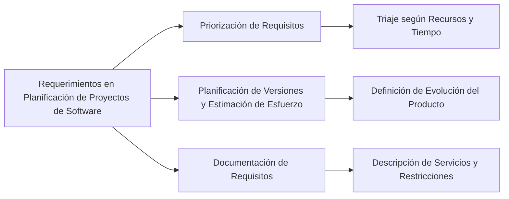

Los requerimientos juegan un papel fundamental en la planificación de un proyecto de software de varias maneras:

1. **Priorización de Requisitos**: Dado que en muchos proyectos se definen numerosos requisitos, pero no todos pueden completarse dentro de las restricciones de tiempo y recursos, es esencial priorizarlos. Esta priorización, conocida como triaje de requisitos, determina qué requisitos debe satisfacer un producto de software según los recursos y el tiempo disponible. Esta priorización es fundamental especialmente en enfoques incrementales para la construcción del software.

2. **Base para la Planificación de Versiones y Estimación de Esfuerzo**: Los requisitos son la base de la planificación de versiones del software, ayudando a definir cómo evolucionará el producto a lo largo de su vida útil. También son esenciales para estimar el esfuerzo necesario para el desarrollo. Además, una vez que se acepta una línea base de requisitos, cualquier cambio solicitado debe evaluarse cuidadosamente, ya que puede afectar significativamente al desarrollo del sistema.

3. **Documentación de Requisitos**: La especificación de los requisitos es un componente crítico en la ingeniería de requerimientos. Incluye declaraciones en lenguaje natural, modelos y diagramas que describen los servicios que se espera que el sistema provea a sus usuarios y las restricciones bajo las cuales debe operar. Estos requisitos funcionales y no funcionales deben ser comprensibles incluso para usuarios del sistema que no posean un conocimiento técnico detallado.

La definición y gestión de requerimientos son esenciales en la planificación de proyectos de software, ya que proporcionan una guía clara sobre qué debe desarrollarse, en qué orden y cómo debe evaluarse el progreso.

### Mindmap

### Ejemplo
En un proyecto para desarrollar un software de gestión educativa, la priorización de los requisitos podría enfocarse primero en características críticas como la inscripción de estudiantes y la gestión de horarios. La planificación de versiones podría incluir mejoras adicionales como módulos de comunicación entre padres y profesores. La documentación de estos requisitos sería detallada para asegurar que todos los stakeholders comprendan las funcionalidades y limitaciones del sistema.

### Glosario
- **Priorización de Requisitos**: Proceso de determinar la importancia relativa de diferentes requisitos en un proyecto.
- **Planificación de Versiones**: Definición de cómo un producto de software evolucionará a lo largo de su vida útil.
- **Documentación de Requisitos**: Registro detallado de lo que se espera que un sistema de software provea y las restricciones asociadas.
- **Triaje de Requisitos**: Proceso de determinar qué requisitos debe satisfacer un producto de software según los recursos y el tiempo disponibles.

### Evaluación

[Evaluación](https://colab.research.google.com/github/IngenieriaDeRequerimientosDaVinci/preguntas/blob/main/Unidad%201/Qu%C3%A9%20rol%20juegan%20los%20requerimientos%20en%20la%20planificaci%C3%B3n%20de%20un%20proyecto%20de%20software/Evaluador.ipynb)