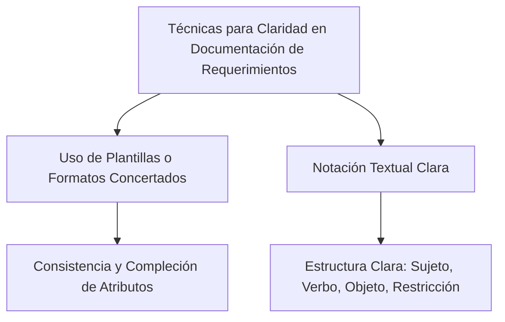

# Pregunta

## ¿Qué técnicas se emplean para asegurar la claridad y precisión en la documentación de los requerimientos?

Para asegurar la claridad y precisión en la documentación de los requerimientos, se pueden emplear las siguientes técnicas:

1. **Uso de Plantillas o Formatos Concertados**: Recurrir al uso de plantillas o formatos estandarizados tanto para el documento completo como para la descripción de los requerimientos individuales es muy recomendable. Una plantilla de requisitos puede tener forma de tabla, con una fila para cada uno de los atributos de un artefacto de requisito. Esto ayuda a mantener la consistencia y a asegurar que se incluyan todos los atributos necesarios, tanto básicos como opcionales, para cada tipo de requisito.

2. **Notación Textual Clara**: La notación textual de un requisito debe incluir un sujeto y un verbo, junto con otros elementos necesarios para expresar la información del requisito de manera clara. Esto implica utilizar estructuras básicas de construcción de requisitos como "[Sujeto/Nombre] debe [verbo] [objeto] [restricción]", lo que ayuda a reducir la ambigüedad y facilitar la comprensión tanto para el equipo de desarrollo como para los clientes o usuarios.

Estas técnicas son esenciales para evitar malentendidos y asegurar que todos los miembros del equipo, así como los stakeholders, tengan una comprensión clara y precisa de lo que se espera del sistema a desarrollar.

### Mindmap

### Ejemplo
En un proyecto para desarrollar una aplicación móvil de salud, el uso de plantillas podría ayudar a describir claramente los requisitos como "El usuario (sujeto) debe poder registrar (verbo) sus síntomas diarios (objeto) en no más de tres pasos (restricción)".

### Glosario
- **Plantilla de Requisitos**: Un formato estandarizado utilizado para documentar los requisitos de manera coherente y completa.
- **Notación Textual de Requisitos**: Método de redacción de requisitos que utiliza una estructura clara y definida para describir cada requisito.

### Evaluación

[Evaluación](https://colab.research.google.com/github/IngenieriaDeRequerimientosDaVinci/preguntas/blob/main/Unidad%201/Qu%C3%A9%20t%C3%A9cnicas%20se%20emplean%20para%20asegurar%20la%20claridad%20y%20precisi%C3%B3n%20en%20la%20documentaci%C3%B3n%20de%20los%20requerimientos/Evaluador.ipynb)